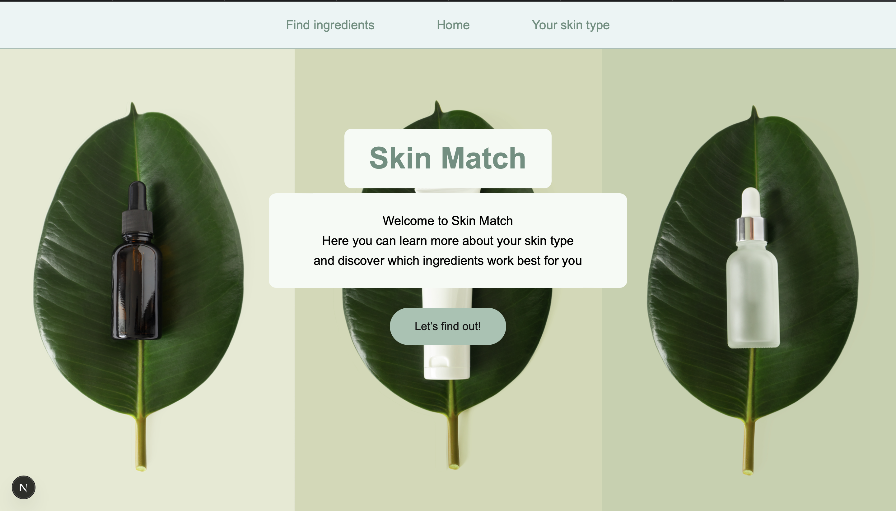
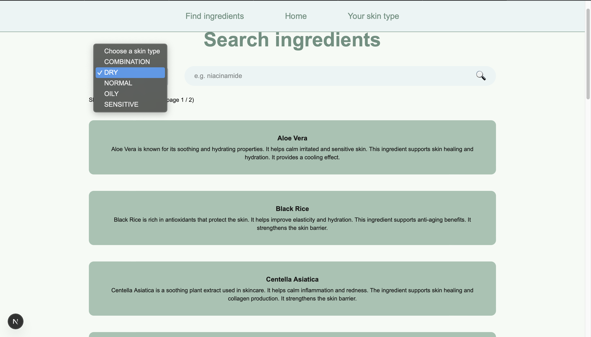
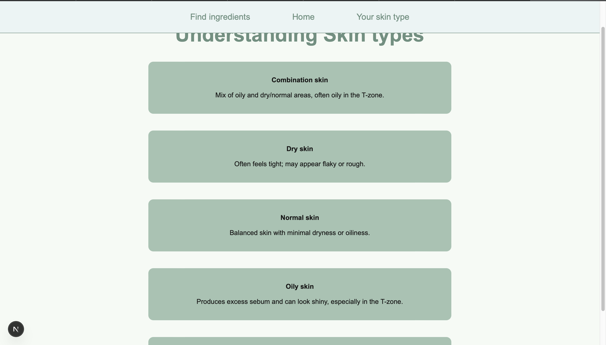

# Skin Match – Frontend (Next.js)

Skin Match is a frontend web application built with **Next.js** 
that helps users understand different skin types and discover skincare ingredients that suit their needs.  
The application consumes a REST API built with Spring Boot.

---

## Features
- Home page with visual introduction
- Search ingredients by skin type and keyword
- Overview of all skin types with descriptions
- Central navigation with navbar
- Responsive and clean UI

---

## Pages & Routes
| Page | Route |
|-----|------|
| Home | `/` |
| Search ingredients | `/skin-match/search` |
| Skin types | `/skin-match/skin-types` |

---

## API Endpoints Used
The frontend communicates with the backend via the following endpoints:

- **GET** `/skin-match/skin-types`  
  Returns all available skin types.

- **GET** `/ingredients?skinType={type}&search={query}&page={n}`  
  Returns ingredients filtered by skin type, search text and pagination.

---

## Tech Stack
- **Next.js (App Router)**
- **TypeScript**
- **Tailwind CSS**
- **REST API (Spring Boot backend)**

---

## Purpose
This project was created as part of a degree project to demonstrate fullstack development, API integration, and modern frontend architecture.

---

## Screenshots

### Home page

### Search ingredients

### Understand skin types

---
